### 2/12/2024

We decided to mount the board at a right angle instead of laying them down flat to make the boards fit the 100 x 100 mm requirement. We also found this 4 switch DC/DC controller from TI. 

### 2/17/2024

We found this DC/DC controller from MPS. The MPQ4214GU which is a external 4 switch controller that is actually in stock. 

### 2/27/2024

Based on the sample application on the MPQ4214 datasheet, I am now calculating operating parameters. 

### 2/29/2024

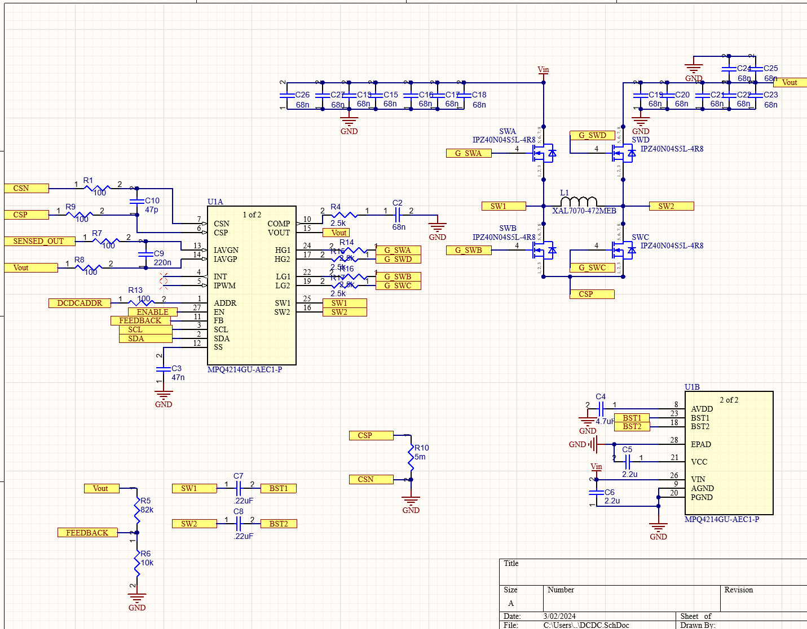

This is the schematic for the DCDC controller IC based off of the given reference design. I still need to make sure that the operating parameters still fall within our  operating parameters.

### 3/5/2024

We didn't pass the PCBWay audit since the testpoints were broken. I fixed them after the deadline (sad). 
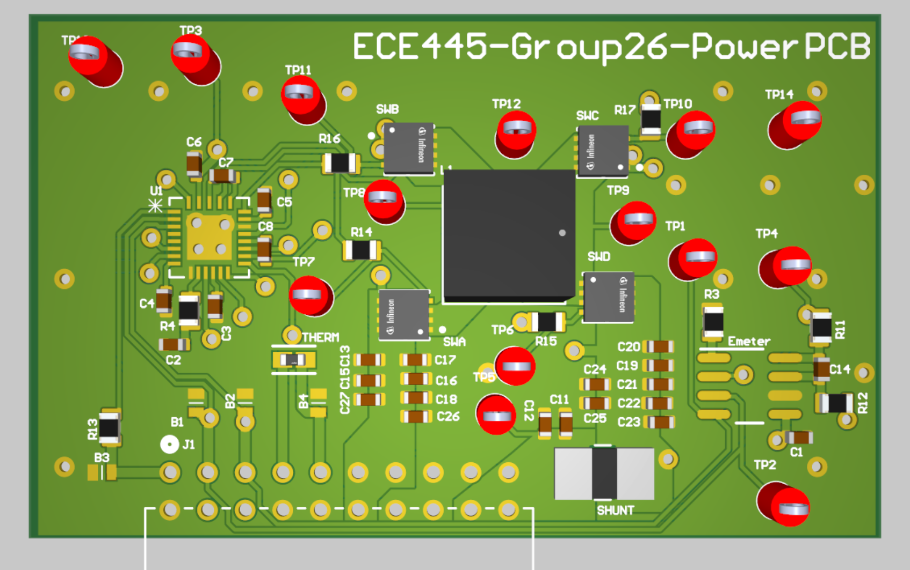

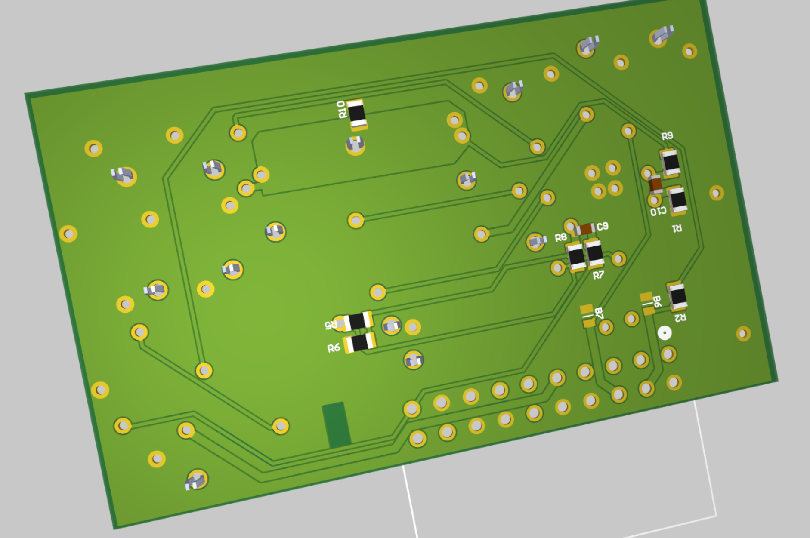

Finished PCB. 

There are testpoints on almost all important nets, except the temp sense. The BOM didn't export correctly due to mismatched resistors and caps. They will need to be remade.   

### 3/10/2024

BOM for the Powerstage has been properly made. The PCB needed some changes to pass the PCBWay audit.
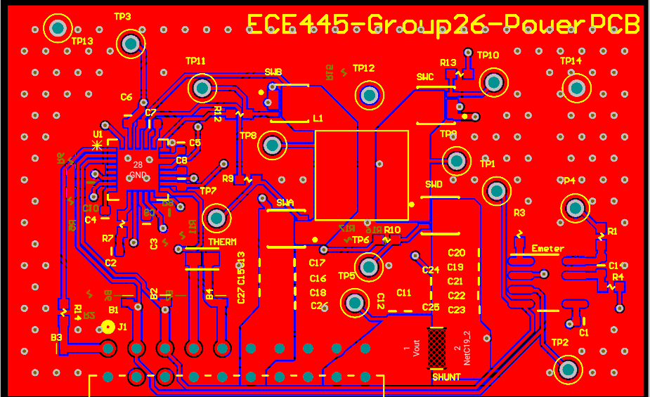

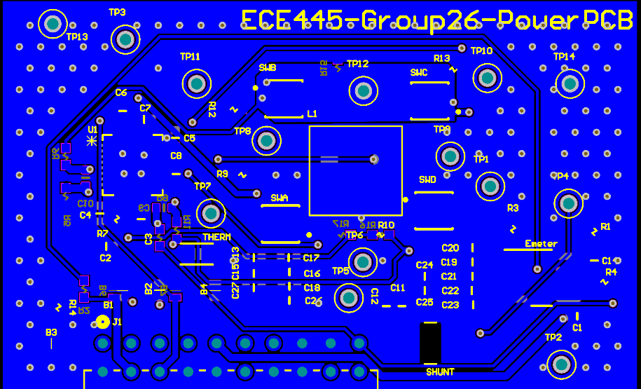

### 3/12/2024

The controller has been routed and passes the PCBWay audits and DRC checks.

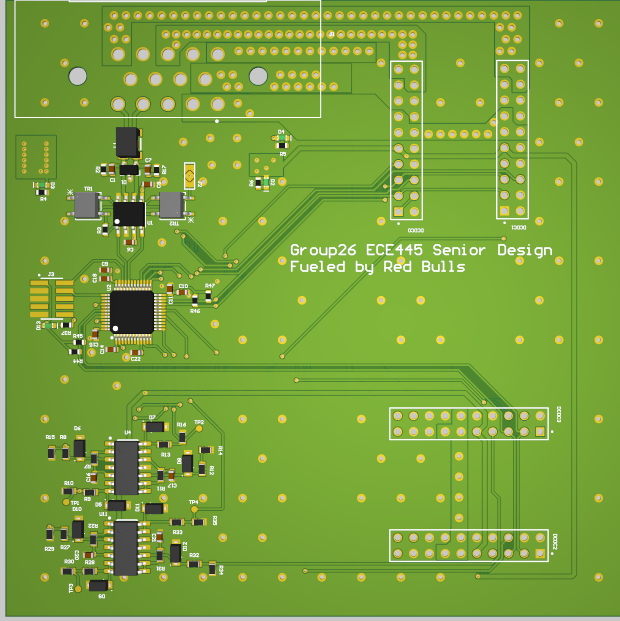

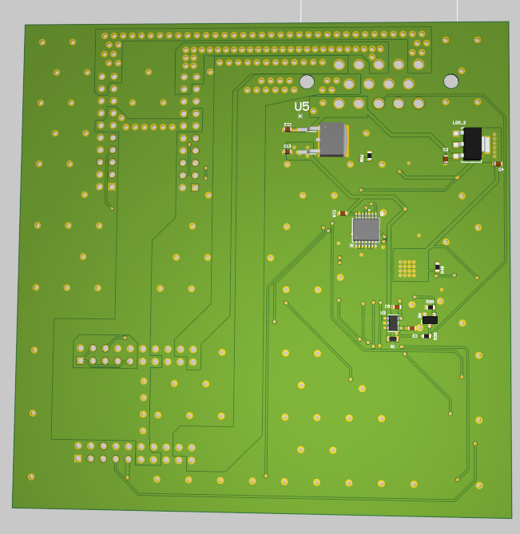

### 3/13/2024

The BOM has been made for both boards and all the 0603 parts have been put together. 

### 3/23/2024

I have gotten the simulation tools from MPS to do the spice simulations. I have imported our design into the tool but are issues in simulating the board.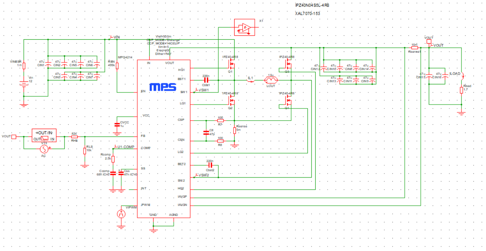

### 4/1/2024

The simulations aren't working due to errors in my model. It is complaining of too many items in the model. I spent some time trying to fix it but I didn't get anywhere. I also recalibrated the Vref to output voltage gain for the DC/DC. 

### 4/10/2024

We got the PCBs this week so we are starting to manufacture the project.

### 4/13/2024

The controller PCB was ready to be tested but the DC/DC module wasn't, so we made sure that CAN and the ADCs both work. 

Before software testing it, I plugged it into the debugger to make sure we can talk to chip.

Using the debugger, we saw that everything worked except for one ADC. Upon looking at the PCB layout, we saw that I had shifted routed the ADC to the pin next to the one setup in software. 

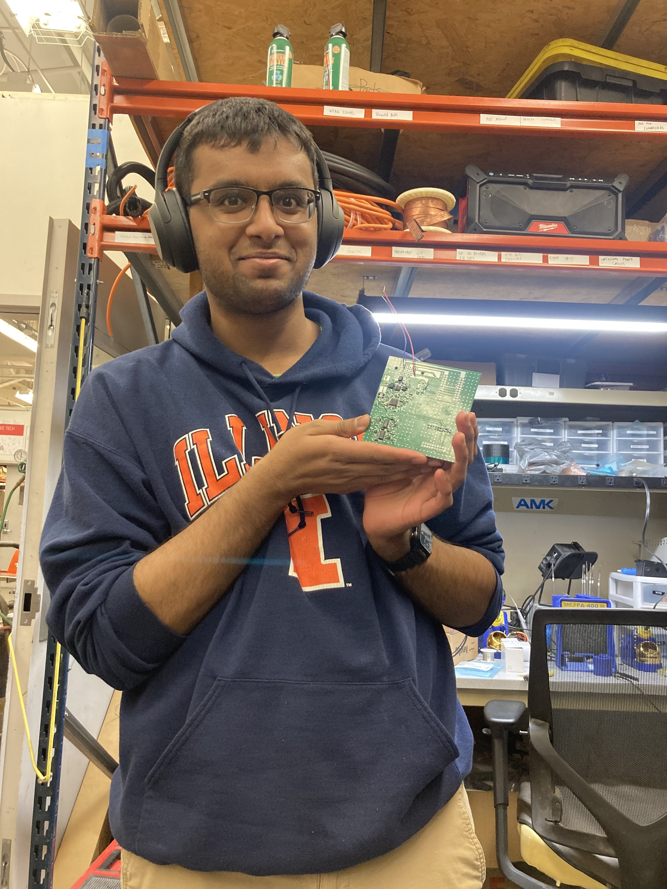

### 4/14/2024

The first powerstage pcb is done. It was a pain to solder due to how small the PCB. The inductor was the worst due to it's huge thermal mass.  

### 4/15/2024

I finished the 2nd powerstage pcb.

We are starting to test everything now.

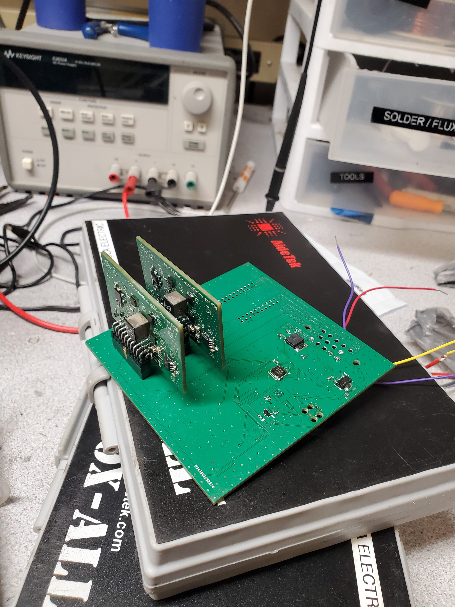

### 4/16/2024

When we turned on the first power output, it blew up the 3.3v ldo and the stm.

We don't know what caused this, but after replacing the ldo and stm the board seems to be fine.

Something buzzes when we turn on the DC/DC.

### 4/17/2024 - 4/30/2024

On the first powerstage PCB I made, I found that one of the gates of the switches is at 400 ohms with respect to ground. The rest of the switches are at 400 kOhm. The result of this is that switch with the grounded gate heats up quickly. Even after reflowing it with hot air it still didn't work. When I probe the broken switch and it's complementary switch, I get these turn on/ off patterns

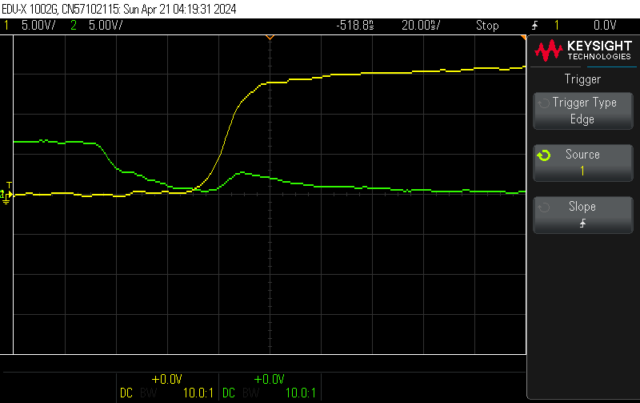

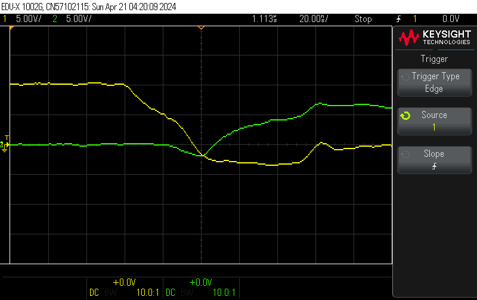

Here we can see that the when the switch turns off, it will "spike" on a little towards the end for some reason.

Using the second power stage PCB, we got a voltage output but the power supply was buzzing. When I probed the 12V DC input, I got the sinusoidal waveform as shown below

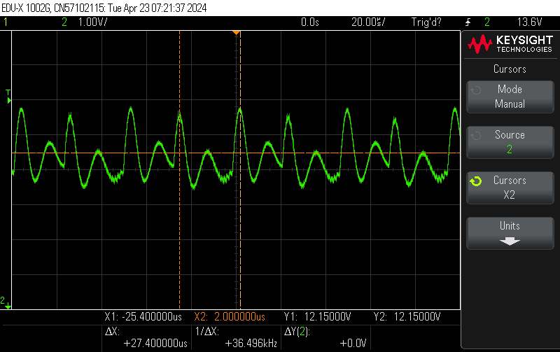

The 5V LDO also had some issues

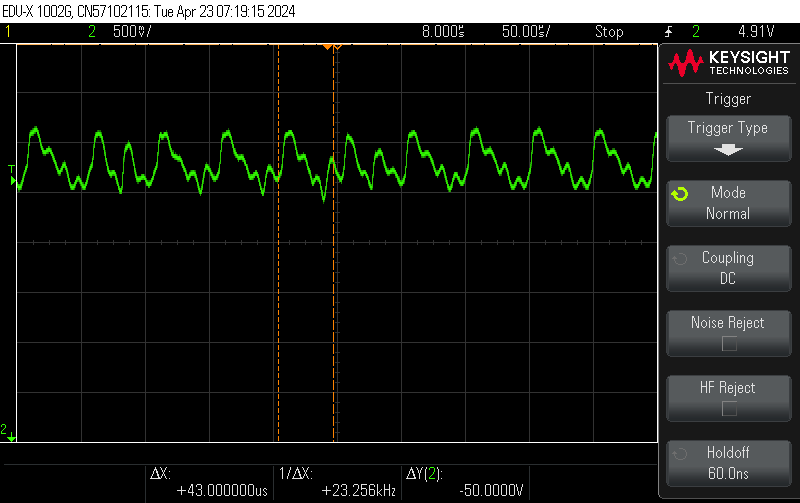

This means that out thermistor readings were quite noisy since the entire supply was undergoing this massive swing.

The output was also quite distorted.

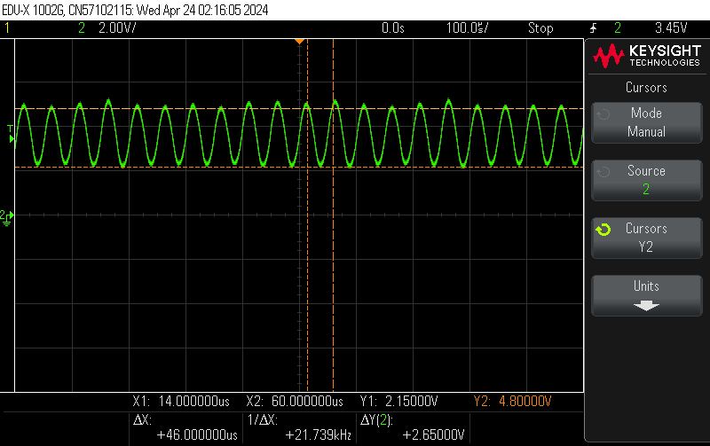

I realized I should add some capacitance to the PCB, but when I solder on the SMD caps I found the PCB shorts itself. This is very odd behaviour to me so I chose to use a huge electrolytic capacitor to hopefully resolve some of these issues. After adding the capacitor we see this on the 5V LDO output.

​				  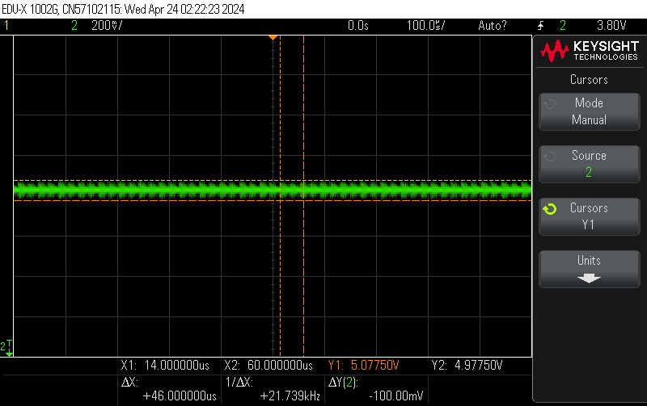

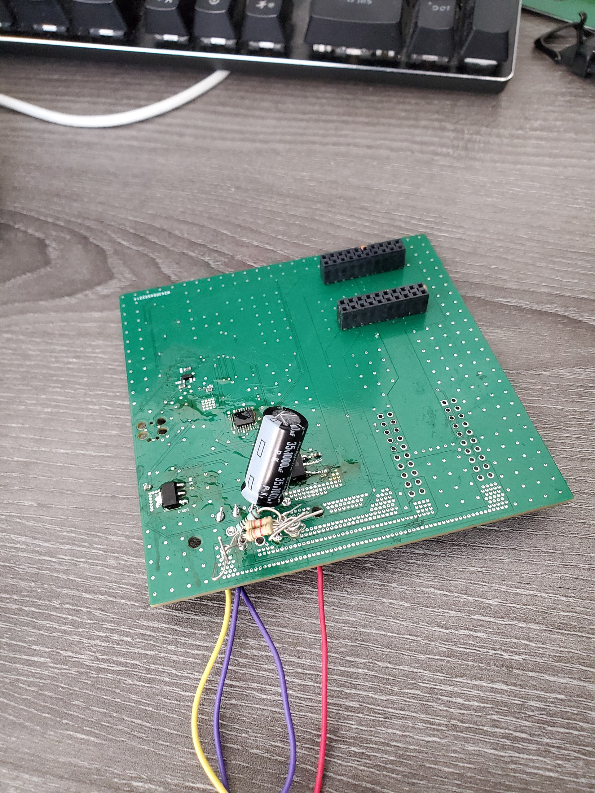

