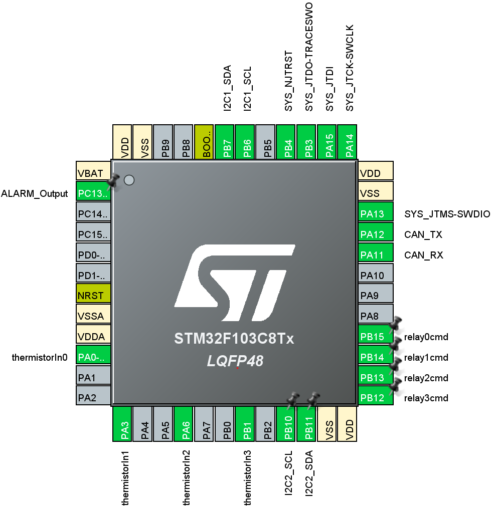
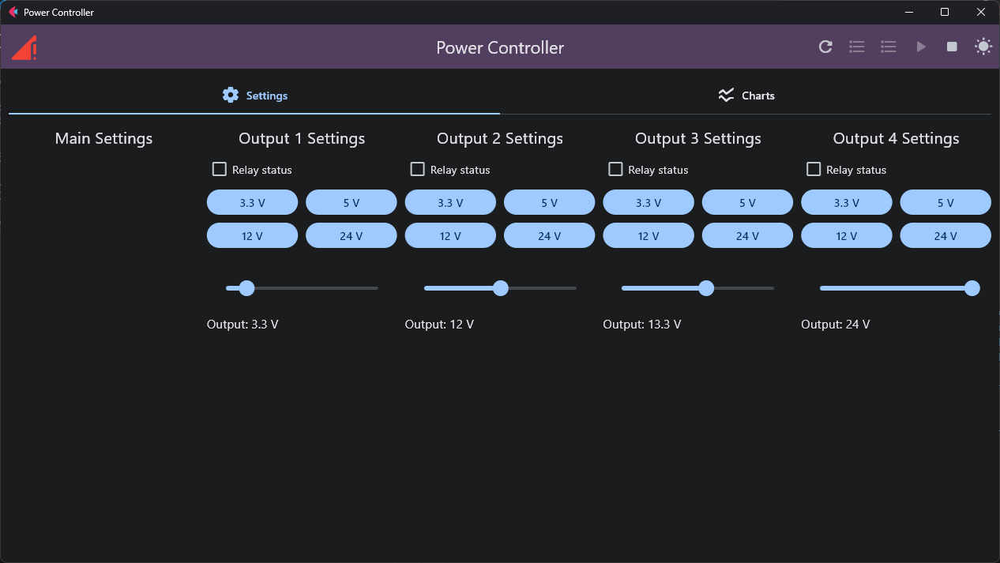
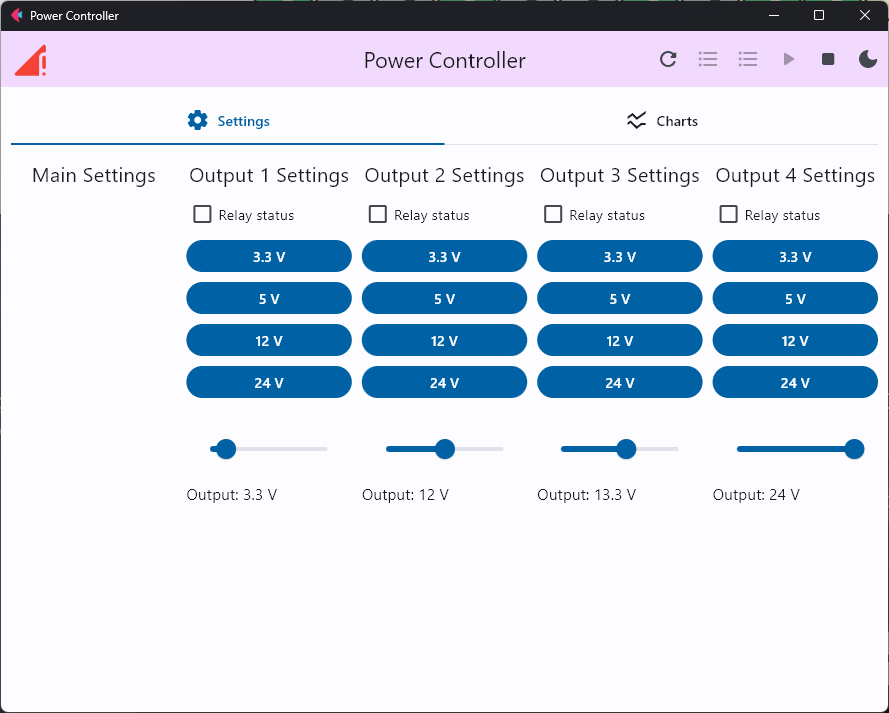
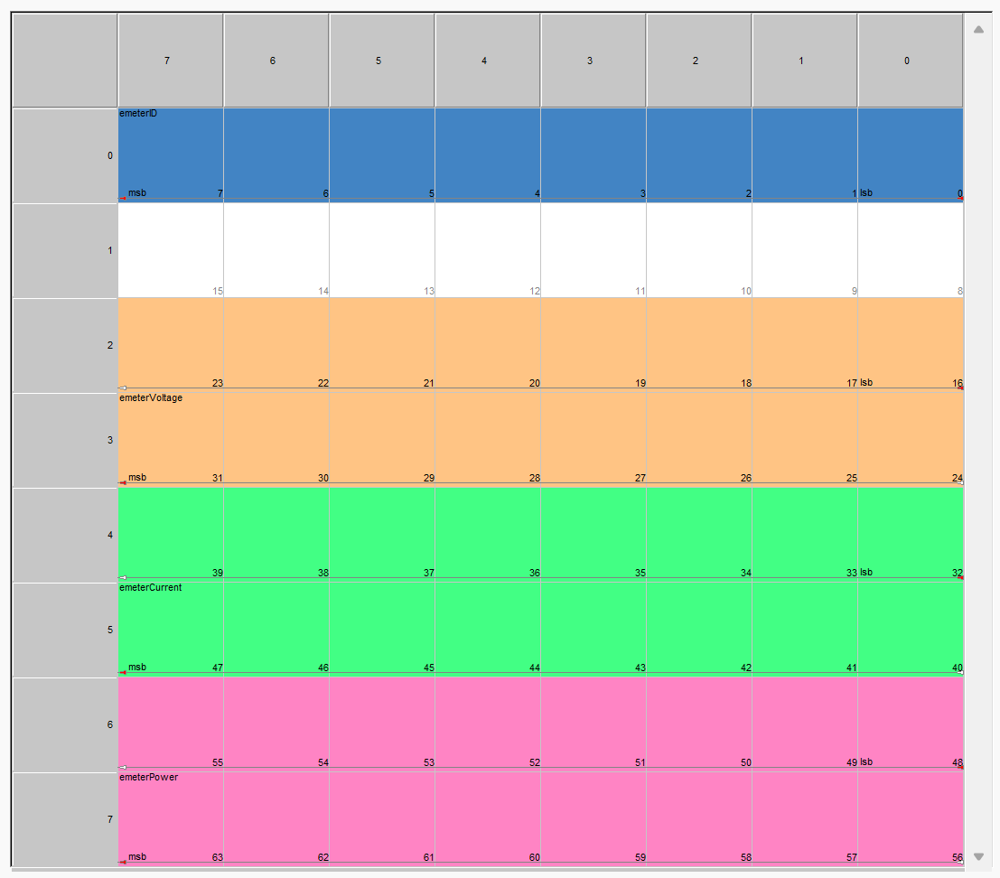

# ECE 445 Notebook - Constantin Legras

## 15/2/2024 - 21/2/2024

* Setup STM32 project in VSCode, figured out C++ compiler setup issues
* Setup Python project for the CAN controller GUI, implemented CAN communication
* Wrote setup guide for the Power Controller GUI

## 22/2/2024 - 28/2/2024

* Updated some STM32 pins to add necessary ones, such as thermistors and JTAG

  

* Wrote first version of a driver class for the INA219 EMeter

* Wrote first version of a driver class for the MPQ4214 buck boost converter

* Started to lay out UI for output controls in controller GUI

  

  
  

## 29/2/2024 - 6/3/2024

* Added external interrupt pins to microcontroller setup
* Wrote outline for CAN interrupt handler and EXTI interrupt handler
* Reorganized some code
* Went through MPQ4214 datasheet to determine default values for registers
* Wrote code to set those default values

## 7/3/2024 - 20/3/2024

* Created CAN DBC file to precisely define all the CAN messages used in the project

  

  Example of the layout of one of those messages

* Implemented mainboard code to properly handle the sending and receiving of some of those messages

## 11/4/2024 - 17/4/2024

* Soldered PCBs
* Tested and fixed small issues in CAN bus code
* Tested thermistor ADC readings through DMA, and tuned ADC speed too prevent a higher than ideal impact on the rest of the code
* Verified ability to detect the presence of a secondary board using the thermistors
* Updated code to reflect addresses of the I2C chips, and tested I2C communication with the emeter
* Slightly updated the GUI code to enable the reading of the emeterFeedback CAN message, which then allows us to plot the signals in our GUI
* Tested and fixed several issues with the buck boost controller code (mostly small bugs in the I2C code). Wrote simple code to toggle between different voltages. We were able to select different output voltages, but unfortunately, an LDO blew up and we had to stop testing

## 18/4/2024 - 24/4/2024

* Wrote STM32 code to periodically send the thermistor readings, and indicating the absence of a board through a special value in those thermistor values
* Wrote code for the GUI to receive and display the received temperatures, except when the value is the invalid flag indicating the absence of a board
